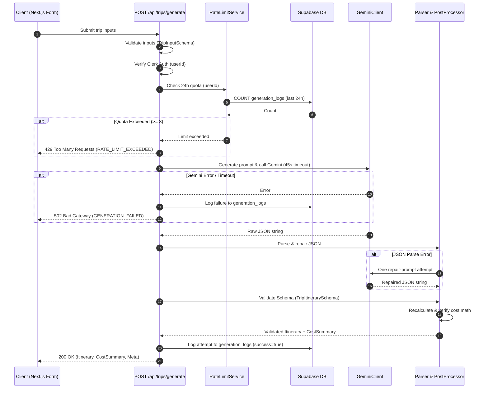

# Voyantra API Contract Specification

This document defines the complete REST API contract for Voyantra (MVP), covering endpoint contracts, request/response models, validation boundaries, authentication, ownership authorization, error handling, rate limiting, and the AI generation lifecycle.

---

## 1. Overview & Architectural Principles

- **BFF (Backend-for-Frontend) Model**: Next.js App Router Route Handlers (`src/app/api/*`) serve as the single gateway for all operations. The client never talks directly to Supabase, Google Gemini, or Google Places.
- **Stateless & RESTful**: Standard HTTP methods (`GET`, `POST`, `PATCH`, `DELETE`) with standard status codes (`200`, `201`, `204`, `400`, `401`, `404`, `429`, `500`, `502`).
- **Standardized Error Envelope**: All error responses follow a consistent `{ error: { code, message, details? } }` JSON structure.
- **Zero Client-Trust**: User identity is derived strictly from verified Clerk server sessions (`auth()`). All database queries are scoped to the authenticated user ID.

---

## 2. Authentication & Authorization

### 2.1 Authentication Flow
1. Client requests include the secure HttpOnly Clerk session cookie.
2. Next.js Middleware (`src/middleware.ts`) protects `/api/trips/*` and `/api/places/*`, redirecting unauthenticated requests or returning `401 Unauthorized`.
3. Route Handlers call `const { userId } = await auth()` from `@clerk/nextjs/server` via `requireAuthUserId()`.
4. If `userId` is null, the handler immediately returns `401 Unauthorized` (`UNAUTHORIZED`).
5. Verified `userId` is passed directly into domain services (`tripService`, `generationService`, `rateLimitService`).

### 2.2 Authorization & IDOR Prevention
- **User Ownership Scoping**: Every database lookup, update, and deletion is explicitly filtered by `WHERE id = tripId AND user_id = clerkUserId`.
- **404 Masking**: If a user requests a trip ID that does not exist OR belongs to another user, the API returns **`404 Not Found`** (never `403 Forbidden`). This prevents malicious users from determining whether an arbitrary trip UUID exists in the system.

---

## 3. Validation Strategy

| Layer | Responsibility | Mechanisms |
| :--- | :--- | :--- |
| **API Boundary** | Request structure, types, length limits, allowed enums, UUID formats, string sanitization | Zod schemas in `src/lib/validations/` (`trip-input.ts`, `api.ts`) |
| **Service Layer** | Business logic validation, 24h rolling rate limits, AI response schema validation, cost math consistency | `generation.service.ts`, `parser.ts`, `rate-limit.service.ts` |
| **Database Layer** | Storage integrity, foreign key cascades, numeric check constraints (`budget >= 0`, `1 <= days <= 7`) | PostgreSQL Constraints in `supabase/migrations/` |

---

## 4. Endpoints Specification

### 4.1 `POST /api/trips/generate`
Generates a complete day-by-day travel itinerary with structured cost estimates using Gemini AI. Does **not** save to the database.

- **Authentication**: Required (Clerk session)
- **Authorization**: Scoped to authenticated user for rate limiting
- **Rate Limit**: 3 generations per user per 24-hour rolling window
- **Business Logic Owner**: `generation.service.ts`
- **Database Tables Accessed**: `generation_logs` (read for quota, insert log on completion), `users` (upsert on first activity)

#### Request Body
```json
{
  "destination": "Paris, France",
  "budgetUsd": 1500,
  "days": 5,
  "travelStyle": "couple",
  "interests": ["museums", "culinary"]
}
```

#### Request Validation Rules (Zod)
- `destination`: `string`, 2–100 characters, trimmed
- `budgetUsd`: `number`, positive integer or float, maximum `9999999`
- `days`: `integer`, minimum `1`, maximum `7`
- `travelStyle`: `enum` (`"luxury" | "budget" | "adventure" | "family" | "couple" | "solo"`)
- `interests`: `array of strings`, max 5 items, each string max 30 characters (optional, default: `[]`)

#### Response (200 OK)
```json
{
  "itinerary": {
    "destination": "Paris, France",
    "days": [
      {
        "dayNumber": 1,
        "theme": "Historic Core & Seine Riverside",
        "slots": [
          {
            "period": "morning",
            "activity": {
              "name": "Louvre Museum",
              "description": "Visit the world's largest art museum and historic monument.",
              "estimatedCostUSD": 22,
              "location": "Rue de Rivoli",
              "durationHours": 3
            }
          },
          {
            "period": "afternoon",
            "activity": {
              "name": "Tuileries Garden & Place de la Concorde",
              "description": "Stroll through the iconic landscaped public garden.",
              "estimatedCostUSD": 0,
              "location": "Place de la Concorde",
              "durationHours": 2
            }
          },
          {
            "period": "evening",
            "activity": {
              "name": "Seine River Sunset Cruise",
              "description": "Scenic boat cruise passing illuminated monuments.",
              "estimatedCostUSD": 18,
              "location": "Pont Neuf",
              "durationHours": 1.5
            }
          }
        ],
        "meals": [
          {
            "type": "breakfast",
            "restaurant": {
              "name": "Café de Flore",
              "description": "Classic Parisian cafe with croissants and espresso.",
              "estimatedCostUSD": 15,
              "cuisine": "French Bakery"
            }
          },
          {
            "type": "lunch",
            "restaurant": {
              "name": "Bistrot Richelieu",
              "description": "Traditional bistro near Palais Royal.",
              "estimatedCostUSD": 30,
              "cuisine": "French Bistro"
            }
          },
          {
            "type": "dinner",
            "restaurant": {
              "name": "Le Comptoir du Relais",
              "description": "Vibrant Saint-Germain dinner with seasonal specialties.",
              "estimatedCostUSD": 55,
              "cuisine": "French"
            }
          }
        ]
      }
    ],
    "hotels": [
      {
        "name": "Hotel Le Marais",
        "description": "Charming boutique hotel within walking distance of galleries and cafes.",
        "estimatedCostUSD": 180,
        "rating": 4.6,
        "priceTier": "moderate"
      }
    ]
  },
  "costSummary": {
    "lodging": 720,
    "food": 450,
    "activities": 180,
    "transport": 60,
    "misc": 40,
    "total": 1450
  },
  "meta": {
    "promptVersion": "itinerary-v1",
    "budgetDelta": -50,
    "overBudget": false,
    "warnings": [],
    "placesEnriched": false,
    "generationDurationMs": 7820
  }
}
```

#### Status & Error Codes
- `200 OK`: Successful generation
- `400 Bad Request`: `VALIDATION_ERROR` (invalid input fields)
- `401 Unauthorized`: `UNAUTHORIZED` (missing or invalid session)
- `429 Too Many Requests`: `RATE_LIMIT_EXCEEDED` (daily 3/day generation cap reached)
- `502 Bad Gateway`: `GENERATION_FAILED` (Gemini API error, timeout, safety refusal, or unparseable JSON)
- `500 Internal Server Error`: `INTERNAL_SERVER_ERROR` (unexpected error)

---

### 4.2 `GET /api/trips`
Retrieves a paginated list of summary cards for all trips saved by the authenticated user.

- **Authentication**: Required
- **Authorization**: Filtered strictly to `WHERE user_id = clerkUserId`
- **Business Logic Owner**: `trip.service.ts`
- **Database Tables Accessed**: `trips` (SELECT)

#### Query Parameters
- `limit`: `integer`, optional (1–50, default: `50`)
- `offset`: `integer`, optional (min: `0`, default: `0`)

#### Response (200 OK)
```json
{
  "trips": [
    {
      "id": "7b0a8831-9f93-4186-9dc7-b4d216f4b6ad",
      "title": "Paris, France — 5 days",
      "destination": "Paris, France",
      "days": 5,
      "travelStyle": "couple",
      "budgetUsd": 1500,
      "estimatedTotalUsd": 1450,
      "feedback": "positive",
      "createdAt": "2026-08-16T10:00:00Z",
      "updatedAt": "2026-08-16T10:00:00Z"
    }
  ],
  "total": 1
}
```

#### Status & Error Codes
- `200 OK`: List retrieved
- `401 Unauthorized`: `UNAUTHORIZED`
- `500 Internal Server Error`: `DATABASE_ERROR`

---

### 4.3 `POST /api/trips`
Saves a generated itinerary and cost snapshot to the user's permanent library.

- **Authentication**: Required
- **Authorization**: User ID bound from server session
- **Business Logic Owner**: `trip.service.ts`
- **Database Tables Accessed**: `users` (upsert), `trips` (INSERT)

#### Request Body
```json
{
  "destination": "Paris, France",
  "budgetUsd": 1500,
  "days": 5,
  "travelStyle": "couple",
  "interests": ["museums", "culinary"],
  "title": "Paris Anniversary Trip",
  "itinerary": { /* Full valid TripItinerary object */ },
  "costSummary": { /* Full valid CostSummary object */ },
  "promptVersion": "itinerary-v1"
}
```

#### Request Validation Rules (Zod)
- Input metadata re-validated against `TripInputSchema`.
- `title`: `string`, 1–100 characters (optional; defaults to `"{destination} — {days} days"`).
- `itinerary`: Must pass `TripItinerarySchema` structural validation.
- `costSummary`: Must pass `CostSummarySchema` validation.
- `promptVersion`: `string`, default `"itinerary-v1"`.

#### Response (201 Created)
```json
{
  "trip": {
    "id": "7b0a8831-9f93-4186-9dc7-b4d216f4b6ad",
    "userId": "user_2...",
    "title": "Paris Anniversary Trip",
    "destination": "Paris, France",
    "budgetUsd": 1500,
    "days": 5,
    "travelStyle": "couple",
    "interests": ["museums", "culinary"],
    "itinerary": { /* full itinerary */ },
    "costSummary": { "lodging": 720, "food": 450, "activities": 180, "transport": 60, "misc": 40, "total": 1450 },
    "generationStatus": "saved",
    "promptVersion": "itinerary-v1",
    "feedback": null,
    "createdAt": "2026-08-16T10:00:00Z",
    "updatedAt": "2026-08-16T10:00:00Z"
  }
}
```

#### Status & Error Codes
- `201 Created`: Trip saved successfully
- `400 Bad Request`: `VALIDATION_ERROR` (invalid trip or corrupted itinerary JSON)
- `401 Unauthorized`: `UNAUTHORIZED`
- `500 Internal Server Error`: `DATABASE_ERROR`

---

### 4.4 `GET /api/trips/[tripId]`
Retrieves full details of a single saved trip.

- **Authentication**: Required
- **Authorization**: Scoped to owner (`WHERE id = tripId AND user_id = clerkUserId`)
- **Business Logic Owner**: `trip.service.ts`
- **Database Tables Accessed**: `trips` (SELECT)

#### Path Parameters
- `tripId`: `string (UUID)`

#### Response (200 OK)
```json
{
  "trip": {
    "id": "7b0a8831-9f93-4186-9dc7-b4d216f4b6ad",
    "userId": "user_2...",
    "title": "Paris Anniversary Trip",
    "destination": "Paris, France",
    "budgetUsd": 1500,
    "days": 5,
    "travelStyle": "couple",
    "interests": ["museums", "culinary"],
    "itinerary": { /* full DayPlan[] and hotels[] */ },
    "costSummary": { /* cost breakdown */ },
    "generationStatus": "saved",
    "promptVersion": "itinerary-v1",
    "feedback": "positive",
    "createdAt": "2026-08-16T10:00:00Z",
    "updatedAt": "2026-08-16T10:00:00Z"
  }
}
```

#### Status & Error Codes
- `200 OK`: Trip found
- `400 Bad Request`: `VALIDATION_ERROR` (invalid UUID format)
- `401 Unauthorized`: `UNAUTHORIZED`
- `404 Not Found`: `NOT_FOUND` (trip does not exist or belongs to another user)
- `500 Internal Server Error`: `DATABASE_ERROR`

---

### 4.5 `DELETE /api/trips/[tripId]`
Deletes a saved trip owned by the user.

- **Authentication**: Required
- **Authorization**: Scoped to owner (`WHERE id = tripId AND user_id = clerkUserId`)
- **Business Logic Owner**: `trip.service.ts`
- **Database Tables Accessed**: `trips` (DELETE)

#### Path Parameters
- `tripId`: `string (UUID)`

#### Response (204 No Content)
*Empty response body.*

#### Status & Error Codes
- `204 No Content`: Successfully deleted
- `400 Bad Request`: `VALIDATION_ERROR` (invalid UUID format)
- `401 Unauthorized`: `UNAUTHORIZED`
- `404 Not Found`: `NOT_FOUND` (trip does not exist or belongs to another user)
- `500 Internal Server Error`: `DATABASE_ERROR`

---

### 4.6 `PATCH /api/trips/[tripId]`
Updates mutable trip metadata: user feedback rating (`positive`, `negative`, or `null`) and/or custom trip title.

- **Authentication**: Required
- **Authorization**: Scoped to owner (`WHERE id = tripId AND user_id = clerkUserId`)
- **Business Logic Owner**: `trip.service.ts`
- **Database Tables Accessed**: `trips` (UPDATE)

#### Request Body
```json
{
  "feedback": "positive",
  "title": "Summer in Paris 2026"
}
```

#### Request Validation Rules (Zod)
- `feedback`: `enum ("positive", "negative")` or `null` (optional)
- `title`: `string`, 1–100 characters (optional)
- Refinement: At least one field must be supplied.

#### Response (200 OK)
```json
{
  "trip": {
    "id": "7b0a8831-9f93-4186-9dc7-b4d216f4b6ad",
    "title": "Summer in Paris 2026",
    "feedback": "positive",
    "updatedAt": "2026-08-16T10:15:00Z"
  }
}
```

#### Status & Error Codes
- `200 OK`: Trip updated
- `400 Bad Request`: `VALIDATION_ERROR`
- `401 Unauthorized`: `UNAUTHORIZED`
- `404 Not Found`: `NOT_FOUND`
- `500 Internal Server Error`: `DATABASE_ERROR`

---

### 4.7 `GET /api/trips/quota`
Returns the user's daily generation limit status and remaining quota for UI display.

- **Authentication**: Required
- **Authorization**: Scoped to authenticated user
- **Business Logic Owner**: `rate-limit.service.ts`
- **Database Tables Accessed**: `generation_logs` (COUNT where `user_id = $1 AND created_at >= NOW() - INTERVAL '24 hours'`)

#### Response (200 OK)
```json
{
  "limit": 3,
  "used": 1,
  "remaining": 2,
  "resetsAt": "2026-08-17T10:00:00Z"
}
```

#### Status & Error Codes
- `200 OK`: Quota retrieved
- `401 Unauthorized`: `UNAUTHORIZED`
- `500 Internal Server Error`: `DATABASE_ERROR`

---

## 5. Generation Lifecycle & Pipeline



---

## 6. Error Handling & Standard Error Shape

### 6.1 Standard Error Envelope
All error responses from any API route strictly return this JSON shape:
```json
{
  "error": {
    "code": "VALIDATION_ERROR",
    "message": "The request body failed validation.",
    "details": [
      {
        "field": "days",
        "message": "Maximum 7 days"
      }
    ]
  }
}
```

### 6.2 Error Code Mapping

| Status Code | Error Code | Description | User-Facing Action |
| :--- | :--- | :--- | :--- |
| `400` | `VALIDATION_ERROR` | Request schema validation failure | Highlight invalid fields in UI |
| `401` | `UNAUTHORIZED` | Missing or invalid Clerk session | Redirect to `/sign-in` |
| `403` | `FORBIDDEN` | Action forbidden (terms not accepted) | Redirect to settings / accept terms |
| `404` | `NOT_FOUND` | Resource not found or not owned | Show 404 message or redirect to `/trips` |
| `429` | `RATE_LIMIT_EXCEEDED` | Daily generation quota exhausted (3/day) | Show daily limit banner with reset time |
| `502` | `GENERATION_FAILED` | Gemini error, timeout, safety block | Display retry button with helpful message |
| `502` | `PLACES_UNAVAILABLE` | External Places API down | Fallback gracefully; non-fatal |
| `500` | `DATABASE_ERROR` | Supabase operation failed | Show general error toast; allow retry |
| `500` | `INTERNAL_SERVER_ERROR` | Unexpected server crash | Display generic system error alert |

---

## 7. TypeScript Types Alignment

Comparing the proposed API contract against existing definitions in `src/types/`:

1. **`src/types/api.ts`**: Currently a 4-line stub. Needs full request/response types:
   - `ApiResponse<T>`, `ApiErrorResponse`, `ApiErrorCode`
   - `GenerateTripRequest`, `GenerateTripResponse`
   - `CreateTripRequest`, `CreateTripResponse`
   - `TripListResponse`, `TripDetailResponse`, `UpdateTripRequest`
   - `TripQuotaResponse`
2. **`src/types/itinerary.ts`**: Currently a 4-line stub. Needs domain types:
   - `TripItinerary`, `DayPlan`, `DaySlot`, `DayPeriod`
   - `Activity`, `Restaurant`, `MealSlot`, `MealType`, `Hotel`, `PriceTier`
   - `CostSummary`, `GenerationMeta`
3. **`src/types/trip.ts`**: Already has database row types (`Trip`, `TripInsert`, `TripUpdate`). Needs:
   - `TripSummary` (card representation for `GET /api/trips`)
